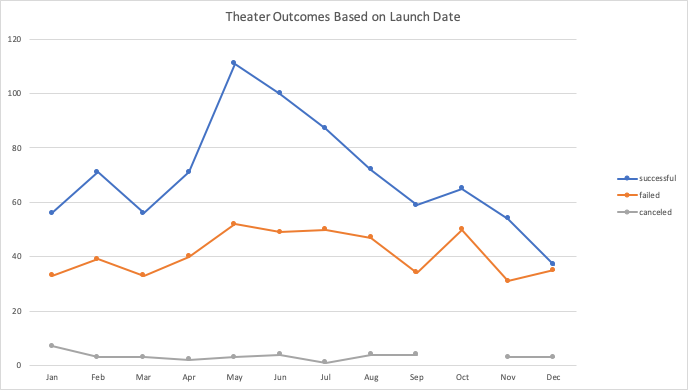
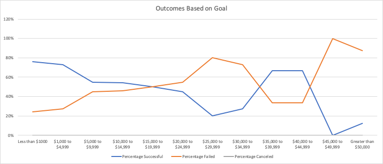

# Kickstarting with Excel

## Overview of Project

### Purpose
The purpose of this analysis is to assist Louise in uncovering how different campaigns do in relation to their launch dates and their funding goals. This will be unraveled by creating analytical visualizations and analysis from campaigns outcomes based on their launch dates and funding goals from the Kickstarter dataset. The main focus will be theater “category” and play “subcategory”. Conclusions will be reported based on the analyses that will be created. 

## Analysis and Challenges

### Analysis of Outcomes Based on Launch Date
 

### Analysis of Outcomes Based on Goals

 

### Challenges and Difficulties Encountered
One of the challenges I faced during this analysis was during the analysis of outcomes based on launch date. I had created a pivot table from the kickstarter data and had placed the appropriate pivot table fields in the filters, columns, rows, and values. I had trouble creating the appropriate pivot line chart from the pivot table. My first choice of pivot line chart was the stacked line with markers style, the result did not match with the chart presented on the module challenge. In order to fix this, I went back to the modules to see what the correct pivot line chart that was used. Located on module 1.3.3 the correct pivot line chart used was line with markers style. After selecting this pivot line chart style, it was an exact match with the example presented. 

## Results

- What are two conclusions you can draw about the Outcomes based on Launch Date?
  - According to the theater outcomes based on launch date, two conclusions that can be drawn are that the most successful theater kickstarter campaigns start in     May and the least successful theater kickstarter campaigns start in December.

- What can you conclude about the Outcomes based on Goals?
	- Successful kickstarter campaigns for plays have lower fundraising goal than the failed kickstarter campaigns for plays. There’s a higher success rate for         kickstarter play campaigns that have a fundraising goal less than $1,000. As for fundraising goals between $40,000 to $49,999 this shows a higher failure         rate for kickstarter play campaigns.

- What are some limitations of this dataset?
	- A possible limitation of this dataset is the data freshness meaning the most recent year of this data is limited from 2009 to 2017. If Louise were to             determine budgets for the kickstarter play campaign for 2020 there wouldn’t be sufficient data to assist on this. Another potential limitation would be the       lack of granular data on city and state, as US is the target country. The city and state may impact the outcome of the trends that is being shown with the       data given.

- What are some other possible tables and/or graphs that we could create?
	- For further analysis a possible table that can be created is having the same data from the “Outcomes Based on Goals” but adding another column “Percentage of     Total Projects from Grand Total”. To do so, take the sum of the “Total Projects” column have this value in cell E14 with =sum(E2:E13) as the formula. This       value represents the grand total of the total projects for subcategory of plays. In I1 label this as “Percentage of Total Projects from Grand Total”. In I2       have =(E2/$E$14) as the formula and then drag this formula down to I13. Then change I column to percentage values. The values in this column will present the     percentage of play projects in the certain goal parameters; ultimately shows where the majority of the play fundraising campaign’s goal falls into. 
	- To represent this data in a graph, highlight column A and column I and insert a clustered column graph. This graph will give a visualization of where the         majority of kickstarter fundraising campaigns goals reside. From this graph, it shows that majority of the play campaign’s goal fall into tier of less than       $1000 and $1000 to $4999.
